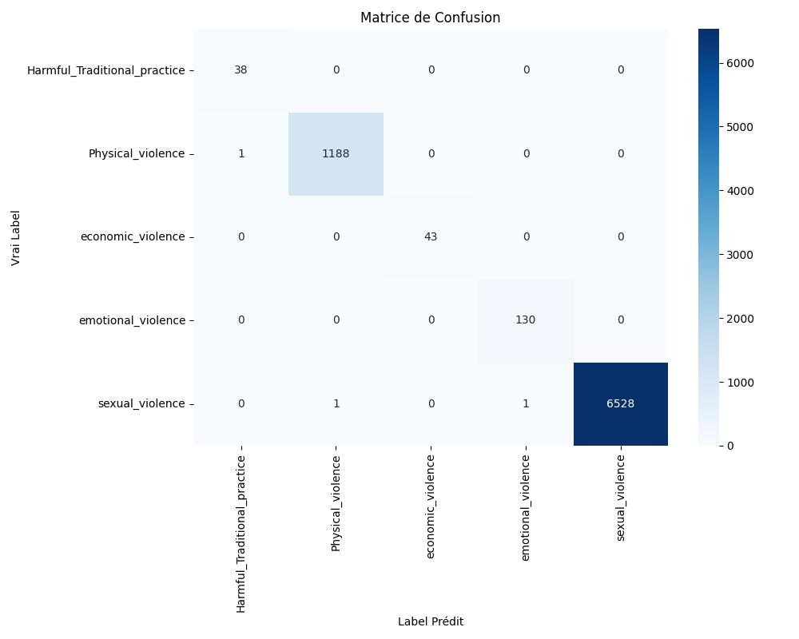
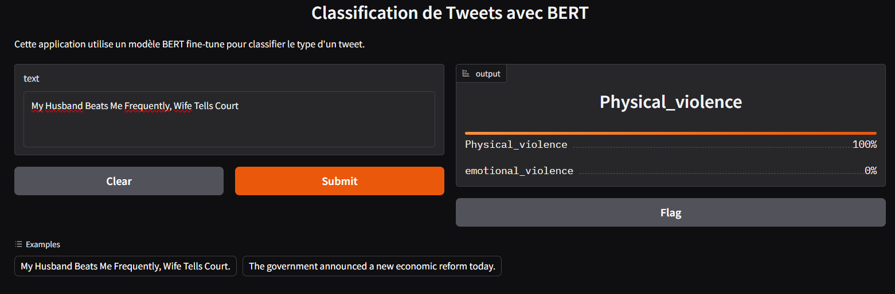

# BERT Classification - tweet vs type

Devoir Pratique n°3 - NLP avec PyTorch : Fine-tuning de BERT pour la classification de texte.

**Binôme :** Jürgen BOLLO KONDABEKA  & Cheikh MBALLO

## 1. Présentation du dataset

- **Source** : (https://drive.google.com/file/d/1hMKWd8BAymWMo1YmhHeXYbEaKEL-YrGF/view) (`Train.csv`)
- **Tâche** : classification du texte de la colonne `tweet`  selon la colonne `type` .
- **Nombre total d'exemples** : _39650_
- **Nombre de classes** : _5_
- **Distribution des classes** : _ le dataset est fortement déséquilibré _

  | Classe                       | Nombre d'exemples |
  |------------------------------|-------------------|
  | sexual_violence              | 32648             |
  | Physical_violence            | 5946              |
  | emotional_violence           | 651               |
  | economic_violence            | 217               |
  | Harmful_Traditional_practice | 188               |

  - **Stratégie adoptée** :_Utilisation de poids de classes dans la loss (class_weight="balanced")_
  
  _On donne un "poids" plus fort aux erreurs faites sur les classes minoritaires. Par exemple, se tromper sur un exemple de Harmful_Traditional_practice coûtera beaucoup plus cher au modèle que de se tromper sur un exemple de sexual_violence.

Avantage : Rapide à mettre en place, pas de perte de données.

Mise en œuvre : Utiliser sklearn.utils.class_weight.compute_class_weight et passer ces poids à la fonction CrossEntropyLoss dans PyTorch_ (ex. regroupement des classes minoritaires en "Other", sous-échantillonnage des classes majoritaires, ou poids de classes dans la loss)
- **Longueur des textes (tokens)** : max = _max = 147, 95ème percentile = 76_
  - Justification du `max_length` choisi : _128 (couvre plus de 95% des exemples tout en limitant l'empreinte mémoire et le temps d'entraînement)_


## 2. Modèle et choix techniques

- **Modèle pré-entraîné** : `bert-base-uncased`
- **Tokenizer** : `AutoTokenizer` de Hugging Face (`bert-base-uncased`)
- **Tête de classification** : couche `Dropout` + `Linear(hidden_size, num_labels)` appliquée sur le `pooler_output` (représentation du token `[CLS]`)
- **max_length** : 128 
- **Hyperparamètres**
  - Learning rate : 2e-5 à 5e-5
  - Batch size : 16 ou 32
  - Epochs : 3 à 5
  - Optimiseur : `AdamW` (weight_decay=0.01)
  - Scheduler : linéaire avec warmup (optionnel)
  - Loss : `CrossEntropyLoss`
  - Seed : 42 (fixée pour `random`, `numpy`, `torch`)
- **Split** : train/validation stratifié 80/20 (`train_df, val_df` dans `train.py`)

## 3. Étapes de réalisation et difficultés rencontrées

- _étapes suivies (exploration des données, préparation du Dataset, écriture de la boucle d'entraînement, sauvegarde du meilleur modèle, création de la démo Gradio)_ 

- _difficultés rencontrées (déséquilibre des classes, temps d'entraînement, gestion de la mémoire GPU et impossibilité de versionné directement le `best_model.pt` sur github classique )_ 

- _Solutions apportées (regroupement des classes minoritaires en "Other", sous-échantillonnage des classes majoritaires et Git LFS (Large File Storage))_


## 4. Résultats

- **Métriques finales** (sur le jeu de validation) :
  - Accuracy : _0.9996_
  - Loss : _0.0034_
  - F1-score (macro/weighted) : _0.9996_
- **Matrice de confusion** : __

## 5. Démo Gradio

- **Captures d'écran de la démo** : __

- Description de l'interface : saisie d'un texte (tweet), affichage de la classe d'origine prédite et des probabilités par classe, avec exemples pré-remplis.

## 6. Installation et exécution

### Prérequis

```bash
pip install -r requirements.txt
```

### Préparer les données

Placer le fichier `Train.csv` dans le dossier `data/` :

```
data/Train.csv
```

### Entraînement

```bash
python train.py
```


Le meilleur modèle (selon `val_loss`) est sauvegardé dans le dossier de checkpoints (ex. `checkpoints/best_model.pt`).

### Lancer la démo

```bash
python demo.py
```


L'interface Gradio est accessible sur `http://127.0.0.1:7860` (lien affiché dans le terminal).

## 7. Structure du projet

```
bert-classification-wiki-movie-tweets/
├── data/                  # dataset 
│   └── Train.csv
├── dataset.py             # tweetTypeDataset + load_and_split_data
├── model.py               # BerttweetTypeClassifier + create_model
├── train.py               # boucles train_epoch / eval_epoch + main
├── demo.py                # interface Gradio
├── utils.py                # métriques, seed, visualisations
├── requirements.txt
└── README.md
```

## 8. Répartition du travail

| Membre                 | Tâches réalisées                                           |
|------------------------|------------------------------------------------------------|
| Jûrgen BOLLO KONDABEKA |  exploration des données, dataset.py, model.py, README.md  |
| Cheikh MBALLO          |  train.py, demo.py, utils.py, requirements.txt             |

## 9. Versionnement Git

Le projet est versionné fichier par fichier avec un historique de commits progressif (pas un seul commit final). Exemple de séquence de commits recommandée :

```bash
git init
git add .gitignore
git commit -m " ajout .gitignore"

git init
git add data/
git commit -m " ajout dossier data"

git add requirements.txt
git commit -m " ajout requirements.txt"

git add dataset.py
git commit -m " ajout fichier dataset"

git add model.py
git commit -m " ajout fichier model.py"

git lfs install # Installation largefile sur le dossier
git lfs track "checkpoints/best_model.pt" # Demande de suivis du fichier voulu

git add -f checkpoints/best_model.pt           
git commit -m "feat: ajout du meilleur modèle entraîné via LFS" # Ajoute du fichier

git add utils.py
git commit -m " ajout fonctions utilitaires (seed, métriques, visualisations)"

git add train.py
git commit -m " ajout fichier train.py "

git add demo.py
git commit -m " ajout de l'interface Gradio de démo"

git add README.md
git commit -m " ajout fichier README "

git remote add origin <https://github.com/BOLLO22/bert-classification-Train.git>
git push -u origin main
```


